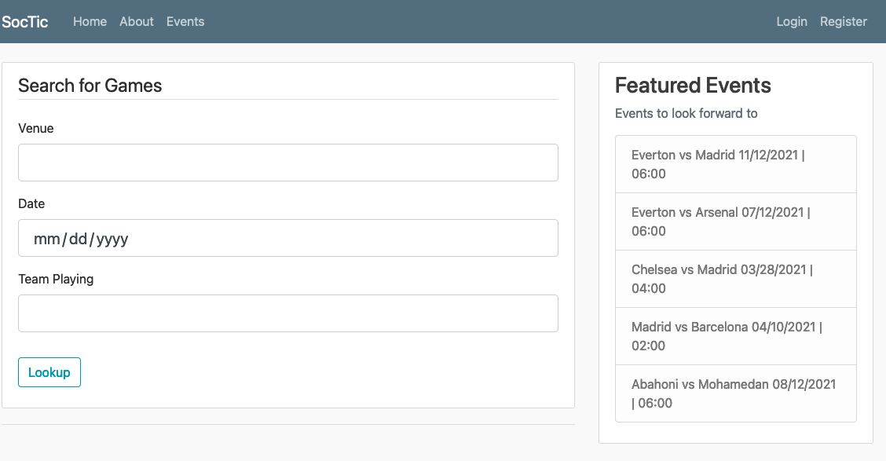
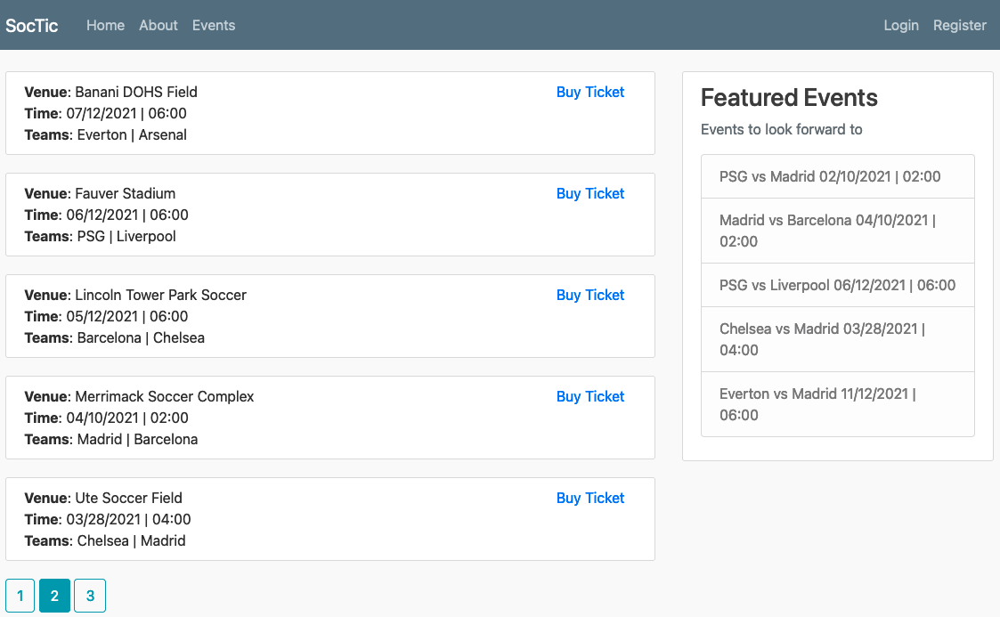
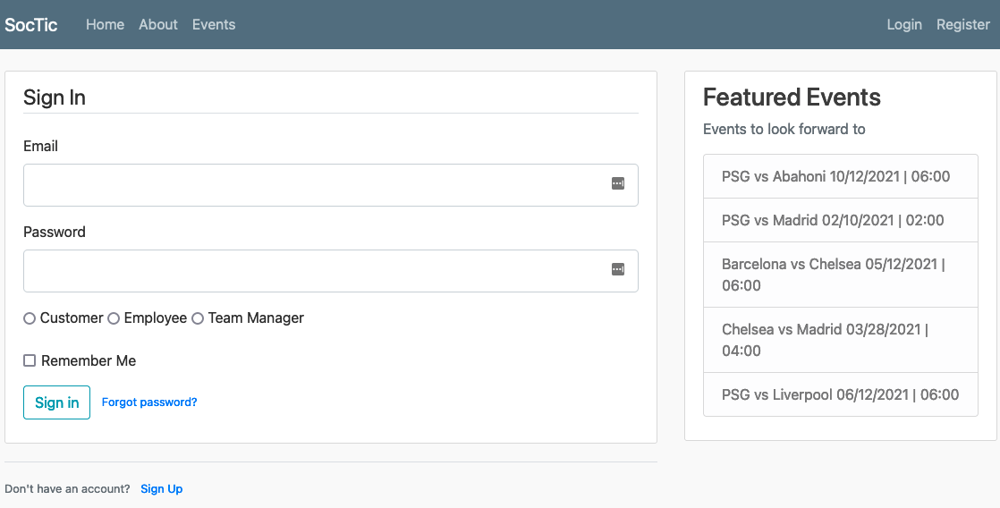
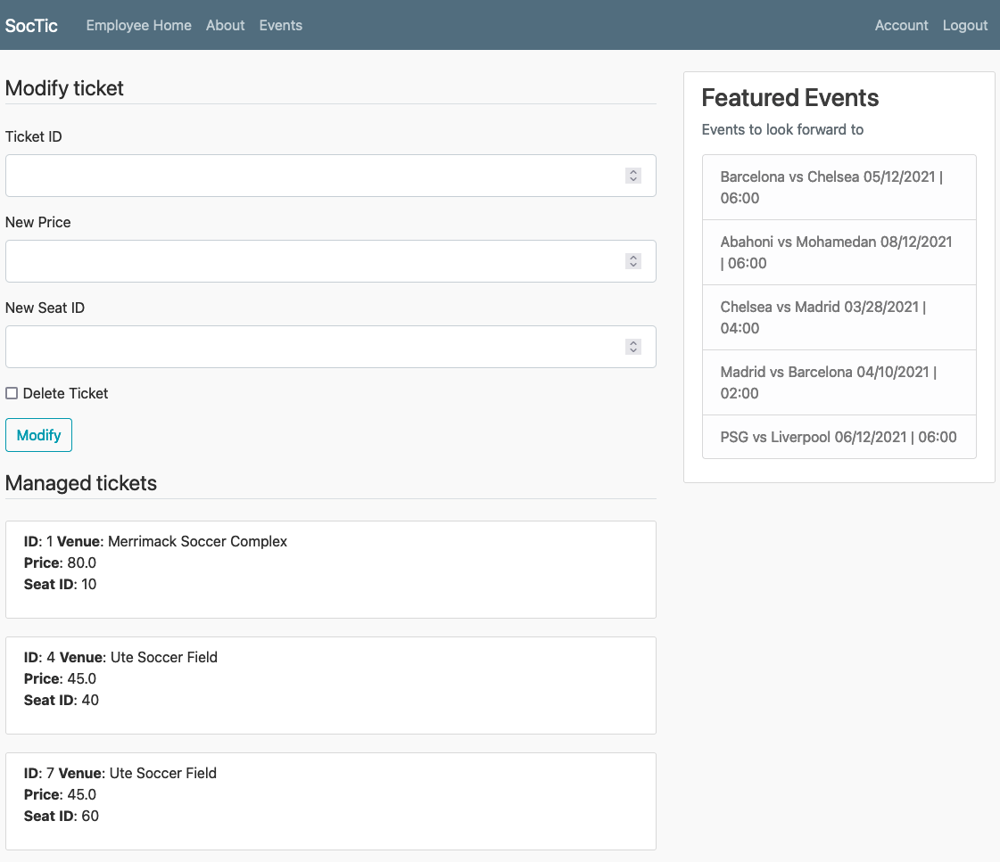

# Soctix - Soccer ticket database management system

A project that defines a database for soccer ticket management, and provides a working prototype of a web interface for various user classes (Customers, Employees, Managers) to browse and use the soccer ticketing system.

Authored by: Abrar Rahman Protyasha, Uzair Tahamid Siam ([@usiam](https://www.github.com/usiam)).

**Note**: This project does *not* (entirely) work in the current state, if not for any reason other than the fact that some developer secrets are needed - namely a database password, and a Google email address to fire emails through. A *lot* of the design decisions are questionable, but as a learning experience this project has been best in its class, bar none!

## Usage instructions

The instructions to get a working interface hosted locally can be broken down into a few themes.

### Creating a database (and loading data)

- Install the [MySQL Community Server](https://dev.mysql.com/downloads/mysql/) and run a MySQL server instance on your computer.
- Create a user - placeholding with `<user>` - with a given password - placeholding with `<password>` - in the MySQL server instance.
- Create the `soctix` database in the MySQL server instance with the appropriate data schema: `mysql -u <user> -p < data/create.sql`.
- Load the `soctix` database in the MySQL server instance with the provided data files: `mysql -u <user> -p < data/load.sql`.

### Replace placeholder configuration data for the Flask application

- In `ticketer/__init__.py`, edit the value mapped to the `SQLALCHEMY_DATABASE_URI` key in the `app.config` map: `app.config['SQLALCHEMY_DATABASE_URI'] = 'mysql+mysqlconnector://<user>:<password>@localhost/soctix'`.
- In `ticketer/__init__.py`, edit the value mapped to the `MAIL_USERNAME` key in the `app.config` map: `app.config['MAIL_USERNAME'] = '<email>@gmail.com'`.
- In `ticketer/__init__.py`, edit the value mapped to the `MAIL_PASSWORD` key in the `app.config` map: `app.config['MAIL_PASSWORD'] = '<password>'`.

### Launch the Flask application

- Install Python dependencies: `pip3 install -r requirements.txt`.
- Launch the application: `python3 run.py`.
- Navigate to http://127.0.0.1:7000/ in a web browser. Enjoy!

## Screenshots

Some parts of the web application's user interface has been captured as follows.

- Landing page. 
- Events listing. 
- Signin page. 
- Authenticated employee view. 
